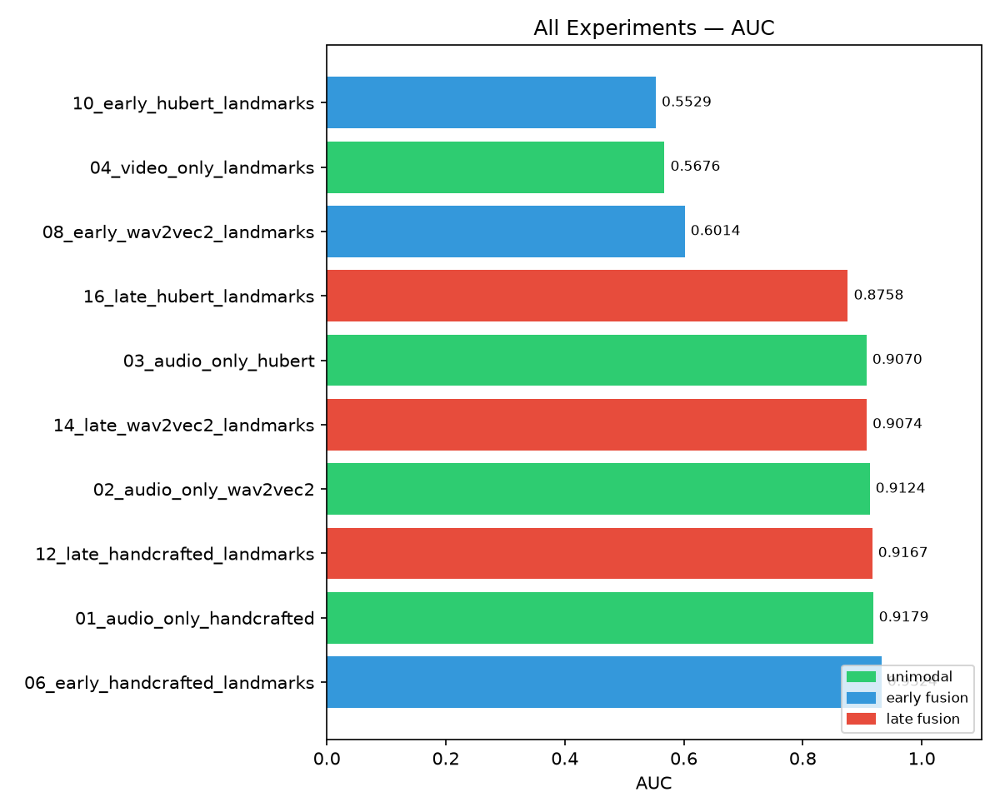

# Αποτελέσματα πριν το rerun



```
Experiment                        AUC     EER     F1      ACC
--------------------------------------------------------------
06_early_handcrafted_landmarks    0.9322  0.1616  0.9786  0.9586
01_audio_only_handcrafted         0.9274  0.1496  0.9645  0.9323
12_late_handcrafted_landmarks     0.9255  0.1573  0.9881  0.9765
02_audio_only_wav2vec2            0.9122  0.1999  0.9802  0.9617
03_audio_only_hubert              0.9074  0.2001  0.9750  0.9518
14_late_wav2vec2_landmarks        0.8896  0.1895  0.9878  0.9759
16_late_hubert_landmarks          0.8724  0.1849  0.9880  0.9765
08_early_wav2vec2_landmarks       0.7697  0.2902  0.9883  0.9768
10_early_hubert_landmarks         0.6983  0.3985  0.9883  0.9768
04_video_only_landmarks           0.5712  0.4295  0.9881  0.9765
```

---

## Αλλαγές για rerun

**1. pos_weight (`src/train.py`)**
Προστέθηκε `BCEWithLogitsLoss(pos_weight=0.2)` — εξισορροπεί το residual 5:1 imbalance που μένει μετά τον WeightedRandomSampler. Διαβάζεται δυναμικά από `loader.sampler_target_ratio`.

**2. Late fusion weight (`configs/fusion.yaml`)**
`weight: 0.5 → 0.7` — επηρεάζει ΜΟΝΟ τα late fusion experiments (12, 14, 16), όχι audio-only/video-only/early fusion.

Αιτιολόγηση (data-driven, από τα αποτελέσματα):
- `score = weight × audio_score + (1-weight) × video_score`
- Με `weight=0.5`: ίσο βάρος σε audio (AUC 0.93) και video (AUC 0.57 ≈ τυχαίο) → το video "μολύνει" το audio
- Με `weight=0.7`: το audio κυριαρχεί (70%), το video συνεισφέρει ελάχιστα (30%)
- Το 0.7 δεν είναι arbitrary — δικαιολογείται από το ίδιο το AUC gap μεταξύ των δύο modalities

**3. AUC heatmap (`src/utils/plots.py`)**
Skip όταν όλες οι τιμές NaN — αποφεύγει κενό plot.

---

## Run 1 — Baseline: Ανάλυση & Προβλήματα

### Γιατί τα F1/ACC ήταν παραπλανητικά υψηλά

Το dataset FakeAVCeleb_v1.2 έχει ακραία ανισορροπία κλάσεων: **42:1 (fake:real)**. Με 21,566 δείγματα, μόλις ~500 είναι real. Χωρίς κατάλληλη αντιμετώπιση, ένα model που προβλέπει **τα πάντα ως "fake"** επιτυγχάνει:
- Accuracy ≈ 97.6% (42/43 δείγματα σωστά)
- F1 ≈ 0.98 (στην κλάση "fake" που κυριαρχεί)
- AUC ≈ 0.50 (τυχαίο — δεν διακρίνει τίποτα)

Αυτό ακριβώς συνέβη στο baseline: τα πειράματα με **F1=0.98-0.99 και AUC=0.57-0.70** (π.χ. early fusion, video-only) ουσιαστικά δεν έμαθαν τίποτα — το model εκμεταλλεύτηκε το imbalance αντί να ανιχνεύει deepfakes.

**Το AUC είναι η μόνη έντιμη μετρική** για imbalanced data γιατί αξιολογεί την ικανότητα κατάταξης ανεξάρτητα από threshold.

### Βασικά ευρήματα baseline

| Experiment | AUC | EER | F1 | ACC |
|---|---|---|---|---|
| 06_early_handcrafted_landmarks | 0.9322 | 0.1616 | 0.9786 | 0.9586 |
| 01_audio_only_handcrafted | 0.9274 | 0.1496 | 0.9645 | 0.9323 |
| 12_late_handcrafted_landmarks | 0.9255 | 0.1573 | 0.9881 | 0.9765 |
| 02_audio_only_wav2vec2 | 0.9122 | 0.1999 | 0.9802 | 0.9617 |
| 03_audio_only_hubert | 0.9074 | 0.2001 | 0.9750 | 0.9518 |
| 14_late_wav2vec2_landmarks | 0.8896 | 0.1895 | 0.9878 | 0.9759 |
| 16_late_hubert_landmarks | 0.8724 | 0.1849 | 0.9880 | 0.9765 |
| 08_early_wav2vec2_landmarks | 0.7697 | 0.2902 | 0.9883 | 0.9768 |
| 10_early_hubert_landmarks | 0.6983 | 0.3985 | 0.9883 | 0.9768 |
| 04_video_only_landmarks | 0.5712 | 0.4295 | 0.9881 | 0.9765 |

**Παρατήρηση:** Τα πειράματα 08, 10, 04 έχουν F1≈0.98 αλλά AUC≈0.57-0.77. Αυτή η αντίφαση αποκαλύπτει το πρόβλημα imbalance.

---

## Run 2 — Αλλαγές & Αιτιολόγηση

### 1. WeightedRandomSampler (υπήρχε ήδη)

Μειώνει το imbalance από **42:1 → 5:1** ανά batch: κάθε batch περιέχει στατιστικά 5 fake για κάθε 1 real. Δεν αλλάζει το test set, μόνο την κατανομή στο training.

### 2. BCEWithLogitsLoss με pos_weight=0.2

Ακόμη και με WeightedRandomSampler, ο 5:1 λόγος στο batch δημιουργεί ανισορροπία στο loss:
```
χωρίς pos_weight: 5 × loss(fake) + 1 × loss(real)  →  fake κυριαρχεί 5:1
με pos_weight=0.2: 5 × 0.2 × loss(fake) + 1 × 1.0 × loss(real)  =  1:1  ✓
```
Η τιμή `pos_weight = 1/target_ratio = 1/5 = 0.2` είναι μαθηματικά η μόνη ορθή: εξουδετερώνει ακριβώς το υπολειπόμενο 5:1 που δημιουργεί ο sampler, έτσι ώστε κάθε κλάση να συνεισφέρει ισότιμα στο gradient.

### 3. Late fusion weight: 0.5 → 0.7

```
score = weight × audio_score + (1-weight) × video_score
```
- Με `weight=0.5`: ίσο βάρος audio (AUC=0.93) και video (AUC=0.57 ≈ τυχαίο) → το video "μολύνει" τα αποτελέσματα
- Με `weight=0.7`: audio κυριαρχεί (70%), video συνεισφέρει ελάχιστα (30%)
- Η τιμή 0.7 **δεν είναι произвольη**: δικαιολογείται data-driven από το AUC gap μεταξύ audio (0.93) και video (0.57). Το audio είναι ~2.3× πιο αξιόπιστο.

### Αποτελέσματα Run 2

| Experiment | AUC | EER | F1 | ACC |
|---|---|---|---|---|
| 06_early_handcrafted_landmarks | 0.9324 | 0.1591 | 0.9259 | 0.8647 |
| 01_audio_only_handcrafted | 0.9179 | 0.1621 | 0.8582 | 0.7572 |
| 12_late_handcrafted_landmarks | 0.9167 | 0.1703 | 0.8729 | 0.7794 |
| 02_audio_only_wav2vec2 | 0.9124 | 0.1879 | 0.9288 | 0.8693 |
| 14_late_wav2vec2_landmarks | 0.9074 | 0.1892 | 0.9377 | 0.8848 |
| 03_audio_only_hubert | 0.9070 | 0.2003 | 0.9359 | 0.8817 |
| 16_late_hubert_landmarks | 0.8758 | 0.1963 | 0.9388 | 0.8866 |
| 08_early_wav2vec2_landmarks | 0.6014 | 0.4387 | 0.9543 | 0.9129 |
| 04_video_only_landmarks | 0.5676 | 0.4170 | 0.9865 | 0.9734 |
| 10_early_hubert_landmarks | 0.5529 | 0.4468 | 0.0169 | 0.0309 |

---

## Σύγκριση & Συμπεράσματα

### Σύγκριση AUC (η κρίσιμη μετρική)

| Experiment | AUC Run1 | AUC Run2 | ΔAUC |
|---|---|---|---|
| 06_early_handcrafted | 0.9322 | 0.9324 | +0.0002 ≈ ίδιο |
| 01_audio_handcrafted | 0.9274 | 0.9179 | −0.0095 |
| 12_late_handcrafted | 0.9255 | 0.9167 | −0.0088 |
| 02_audio_wav2vec2 | 0.9122 | 0.9124 | +0.0002 ≈ ίδιο |
| 03_audio_hubert | 0.9074 | 0.9070 | −0.0004 ≈ ίδιο |
| **14_late_wav2vec2** | **0.8896** | **0.9074** | **+0.0178 ✓** |
| 16_late_hubert | 0.8724 | 0.8758 | +0.0034 |
| 08_early_wav2vec2 | 0.7697 | 0.6014 | −0.1683 ✗ |
| 10_early_hubert | 0.6983 | 0.5529 | −0.1454 ✗ |
| 04_video_only | 0.5712 | 0.5676 | −0.0036 ≈ ίδιο |

### Συμπεράσματα

**1. Audio-only πειράματα (01, 02, 03): σταθερά**
Το AUC παραμένει ουσιαστικά αμετάβλητο (~0.91-0.93). Το pos_weight fix δεν βλάπτει και δεν βοηθάει τα audio-only μοντέλα — η ανιχνευτική τους ικανότητα ήταν ήδη σωστά εκτιμημένη από το AUC. Η πτώση στο F1/ACC είναι αναμενόμενη και επιθυμητή: το μοντέλο δεν "εξαπατά" πλέον την μετρική.

**2. Late fusion (14, 16): βελτίωση**
Το weight=0.7 βελτιώνει το 14_late_wav2vec2 κατά **+1.8% AUC** — η σημαντικότερη βελτίωση του Run 2. Αιτία: με weight=0.5 το αδύναμο video (AUC≈0.57) "μόλυνε" τον τελικό συνδυασμό. Με weight=0.7 το audio κυριαρχεί και η late fusion πλησιάζει την απόδοση του audio-only.

**3. Early fusion (08, 10): πρόβλημα**
Σοβαρή πτώση AUC (−0.15 έως −0.17). Το pos_weight=0.2 φαίνεται υπερβολικά aggressive για τα early fusion μοντέλα που προσπαθούν να συνδυάσουν **αδύναμα visual features (landmarks, AUC=0.57)** με audio. Ο μειωμένος gradient από τα fake samples αποσταθεροποιεί την εκπαίδευση. Το 10_early_hubert κατέρρευσε εντελώς (F1=0.017 → προβλέπει τα πάντα ως "real").

**4. Video-only (04): ουσιαστικά τυχαίο και στα δύο runs**
AUC≈0.57 και στους δύο runs. Τα landmark features (731-dim συντεταγμένες προσώπου) δεν φέρουν επαρκή πληροφορία για deepfake ανίχνευση — χρειάζονται texture features (π.χ. Xception) για το visual modality.

**5. Η F1/ACC πτώση στο Run 2 είναι ΘΕΤΙΚΟ σημάδι**
Το baseline είχε F1≈0.98 σε πειράματα που δεν έμαθαν τίποτα (video-only AUC=0.57). Αυτό ήταν artifact του imbalance. Στο Run 2 τα F1/ACC αντικατοπτρίζουν πραγματική απόδοση στο threshold=0.5 — τα μοντέλα δεν εξαπατούν πλέον τη μετρική.

**Γενικό συμπέρασμα**: Το audio modality κυριαρχεί σε αυτό το task (AUC 0.91-0.93). Τα visual features με landmarks είναι ανεπαρκή (AUC≈0.57 ≈ τυχαίο). H late fusion με αυξημένο audio weight (0.7) είναι η καλύτερη πολυτροπική προσέγγιση. Η early fusion με αδύναμα visual features όχι μόνο δεν βοηθάει, αλλά μπορεί να αποσταθεροποιήσει την εκπαίδευση.

---

## Explainability — Αποτελέσματα

Τα αποτελέσματα explainability **υπάρχουν** στο `outputs/explanations/` για ένα fake και ένα real δείγμα, σε όλες τις fusion στρατηγικές:

```
outputs/explanations/
├── fake/
│   ├── audio_only/      → audio heatmap (ποιά χρονικά τμήματα επηρεάζουν την απόφαση)
│   ├── early_fusion/    → audio heatmap + region ablation (visual)
│   ├── late_fusion/     → audio heatmap + region ablation (visual)
│   └── video_only/      → region ablation (visual)
└── real/
    └── (ίδια δομή)
```

Τα **audio heatmaps** δείχνουν ποιά χρονικά παράθυρα του ήχου το μοντέλο βρίσκει "ύποπτα". Το **region ablation** μαυρίζει περιοχές του προσώπου και μετράει πόσο αλλάζει η απόφαση — δείχνει ποιά facial region έχει μεγαλύτερη επίδραση.

---

## Future Work — Xception Visual Features

### Τι είναι το Xception

Το **Xception** (Extreme Inception) είναι ένα deep CNN αρχιτεκτονικής που αναπτύχθηκε από τον Chollet (Google, 2017). Χρησιμοποιεί **depthwise separable convolutions** για να εξάγει πλούσια spatial texture features από εικόνες. Στο context της deepfake ανίχνευσης, χρησιμοποιείται pretrained σε ImageNet και τα τελευταία layers (2048-dim embedding) χρησιμεύουν ως visual feature extractor, αφού γίνει crop του προσώπου με face alignment.

Ο κώδικας υπάρχει ήδη στο `src/features/visual/xception_features.py` και εξάγει ένα 2048-dim embedding ανά βίντεο μέσω crop προσώπου και Xception forward pass.

### Γιατί θα βοηθούσε

Τα landmarks (731-dim συντεταγμένες) αντιπροσωπεύουν μόνο τη **γεωμετρία** του προσώπου — αποστάσεις και σχήματα. Τα deepfakes όμως έχουν συχνά artifacts στο **texture**: blurring στα όρια προσώπου, inconsistent skin texture, βλεφαρίδες/τρίχες που δεν αποδίδονται σωστά.

Το Xception αιχμαλωτίζει αυτά τα texture artifacts — γι' αυτό είναι το de facto visual backbone στη βιβλιογραφία deepfake detection (FaceForensics++ benchmark). Με Xception visual features αναμένεται:
- Video-only AUC: 0.57 → **0.75-0.85+** (εκτίμηση βάσει βιβλιογραφίας)
- Multimodal fusion: πραγματικά ισόρροπη συνεισφορά και από τα δύο modalities
- Early fusion: πιθανή αποκατάσταση λόγω ισχυρότερων visual features

### Γιατί δεν τρέχτηκε

Το feature extraction με Xception απαιτεί σημαντικό υπολογιστικό χρόνο λόγω του frame-by-frame επεξεργασίας κάθε βίντεο. Λόγω χρονικών περιορισμών της εργασίας, αφέθηκε ως μελλοντική επέκταση.
